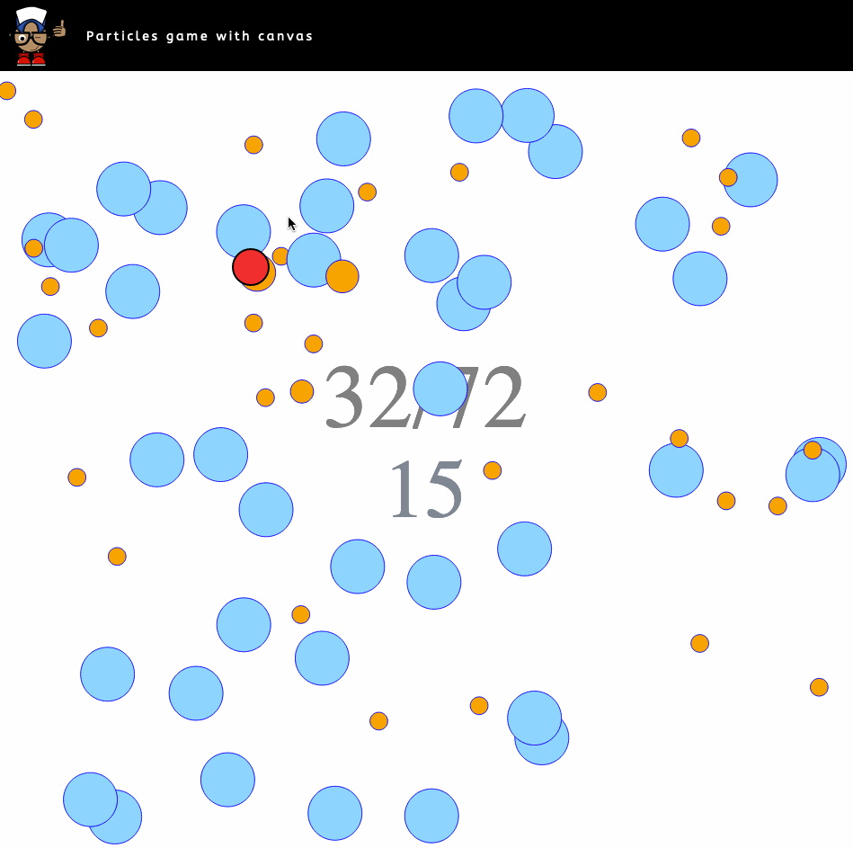

# Particles Game Created with Canvas

I wanted to create a quick game based on particles using canvas and some Maths. The game consists of a number of blue particles moving at random around the screen. Hovering your mouse (the red mouse) over an orange particle turns it to orange. The aim of the game is to turn all particles orange before the timer runs out.

## Prerequisites for running locally
- Docker compose
- Docker

## Running locally
- `./bin/install`
- open `index.html` in your browser

## The Result

